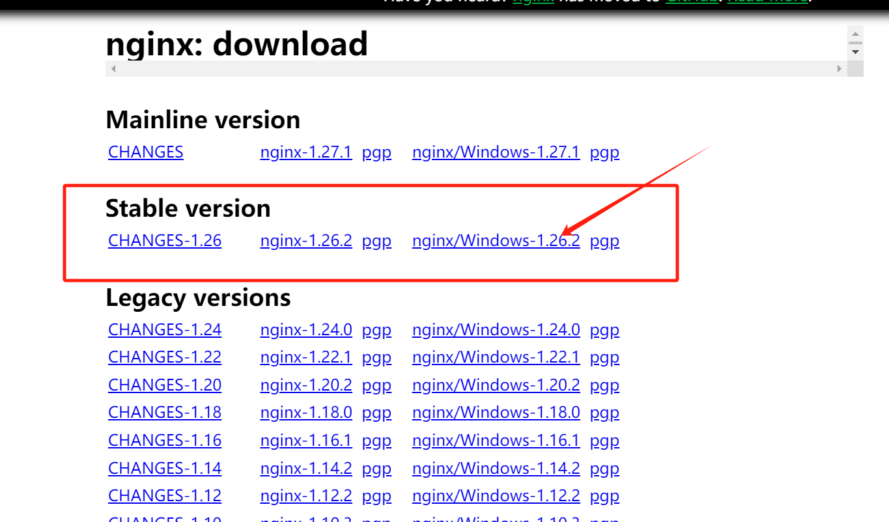
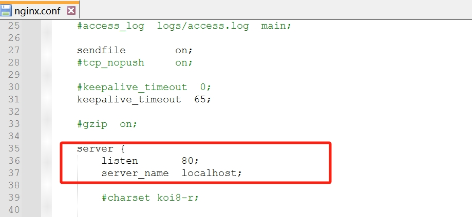

# nginx 的安装和启动

### 下载地址（windows 安装最为简单）
1. 这是下载地址 [nginx url](https://nginx.org/en/download.html);    
2. 下载最稳定的版本：下图标示

3. 找到自己下载的文件， 解压并进入文件(存在nginx.exe的那一层目录)， 执行start nginx.exe, 会看到一闪而过现象， 
4. 然后在本层目录下， 有个conf ， 进入查看nginx.conf文件, 
,
会看到默认的server地址是localhost:80， 访问看这个下面的界面， 就是启动成功了

5. 一些nginx的操作
    1. nginx -s stop 强制关闭nginx 进程
    2. nginx -s quit 这种方式比较温和， 会等进程处理任务完成之后关闭进程
    3. nginx -v 查看版本
    4. nginx -s reload  修改配置之后， 重新加载配置
    5. tasklist | findstr nginx  查看当前nginx 的进程
        1.下列图片显示
        
    6. nginx -t 查看配置文件是否有语法错误
    
### 在windows 使用nginx 的过程中碰到一些问题
1. 多次启动nginx,  会造成多个nginx进程同时运行，影响电脑性能， 改变配置文件， 可能无效等问题， 解决方法就是杀掉所有的nginx 进程。为避免这个问题 保证关掉上一个nginx进程， 再开启新的nginx 服务  
杀掉所有nginx 进程命令： 
`
taskkill /f /im nginx.exe
`

---
# linux的安装
过程未整理, 留坑位，以后整理，目前只为熟悉nginx 的操作。 在window 系统上操作  
---
# 文件目录
|--static  静态文件
